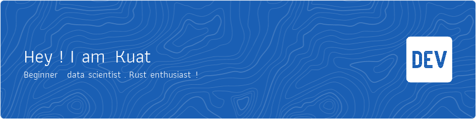

### About Me:
I am an aspiring specialist in big data processing. In addition to my studies, I develop in Python, C++ and TypeScript.

At the moment, I am delving into learning the Rust programming language. In the future, I want to expand my knowledge by studying radio electronics and system programming.

### Social media: 📡    

## Competitions: 🥇

## Languages and Tools

### Languages:

| Python | C | C++ | Rust | TS |
|----------|----------|----------|----------|----------|
|  |  |  |  |  | 

### Best frameworks and main libraries for Python3:

| Pytorch | Selenium | Numpy | Pandas | Sklearn | Matplotlib | OpenCV |
|----------|----------|----------|----------|----------|----------|----------|
|  |  |  |  |  |  | |

### Best frameworks and main libraries for C/C++:

| Qt |
|----------|
|  |

### My tools for Data Manipulation:

| Conda | Jupyter | Postgres | SQLite |
|----------|----------|----------|----------|
|  |  |  |  |

### Environments, Testing, Other:

| NodeJS | Git | Docker | Pytest | Swagger | Postman |
|----------|----------|----------|----------|----------|----------|
|  |  |  |  |  |  |

### OS: ❤️ (linux one love)

| Linux | Arch |
|----------|----------|
|  |  |

